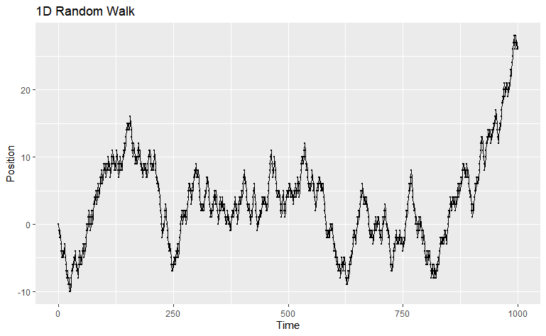
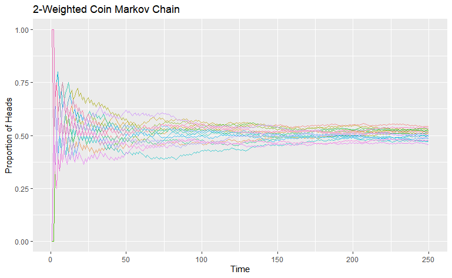
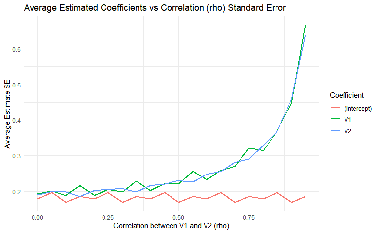

# Mini-Simulations for Learning Concepts

This repository contains a collection of small, interactive simulations designed to help visualize and reinforce concepts from different courses. Each simulation includes adjustable parameters so you can experiment and see how changes affect the outcome.

---

## Simulation 1: 1-D Discrete Random Walk

**Purpose:**  
Helps visualize how randomness accumulates over time and how different probabilities affect the spread and drift of the walk.

**Modifiable Variables:**  
- `p`: probability of stepping right (+1)  
- `q`: probability of stepping left (−1)  
- `r`: probability of staying in place (`1 - (p + q)`)  
- `max_t`: total number of steps in the walk  

**Example Plot:**  

--- 

## Project 2: 2-Weighted Coin Markov Chain

**Purpose:**  
This simulation models a two-state Markov chain using weighted coins. The process works as follows:  
- If the previous flip is **Heads (1)**, the next flip uses Coin 2 with probability `p_2` of Heads.  
- If the previous flip is **Tails (0)**, the next flip uses Coin 1 with probability `p_1` of Heads.  

Over time, this illustrates how dependent random processes converge toward a stationary distribution.

**Modifiable Variables:**  
- `p_1`: probability of Heads when using Coin 1
- `p_2`: probability of Heads when using Coin 2
- `max_t`: number of flips per simulation 
- `n_sims`: number of independent simulations to run

**Example Plot:**  

--- 

## Project 3: Monte Carlo Simulation – Multicollinearity & Harm

**Purpose:**  
This simulation explores how increasing multicollinearity affects:
- The **average estimated regression coefficients**  
- The **standard errors** of the estimates  

**Modifiable Variables:**  
- `rho`: correlation between `V1` and `V2` 
- `n`: number of observations per simulation
- `reps`: number of Monte Carlo repetitions per `rho`  
- `true_coefs`: true coefficient values in the data generating process

**Example Plots:**  
Average Standard Errors vs. Correlation:  

**Credits**
https://www.youtube.com/@very-normal
